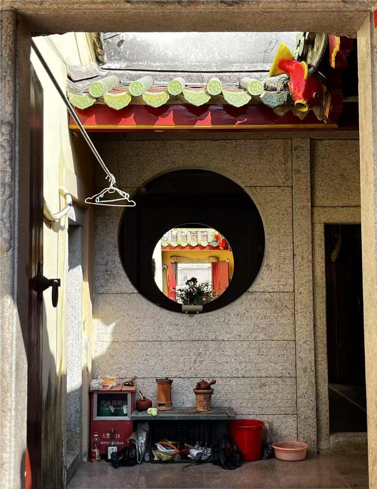

# Introduction
I am an undergraduate at School of Electronics, Nanjing University. I focus on lightweight deep learning, particularly in the field of AIGC, with an emphasis on image and video generation.

# My Notes
- Parallel Computation: [My zhihu account](https://www.zhihu.com/column/c_1866905195625209856 "Zhihu web")
- AIGC: [My zhihu account](https://www.zhihu.com/column/c_1876218406727970816 "Zhihu web")
- Lightweight LLM: [My zhihu account](https://www.zhihu.com/column/c_1876218406727970816 "Zhihu web")

# Pub

